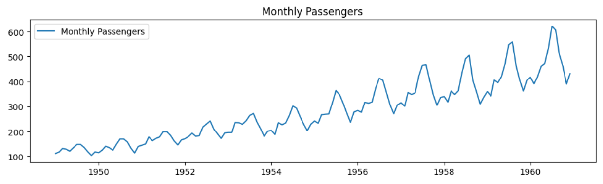
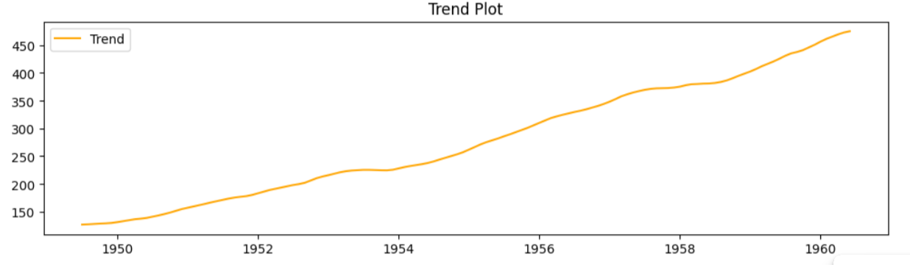
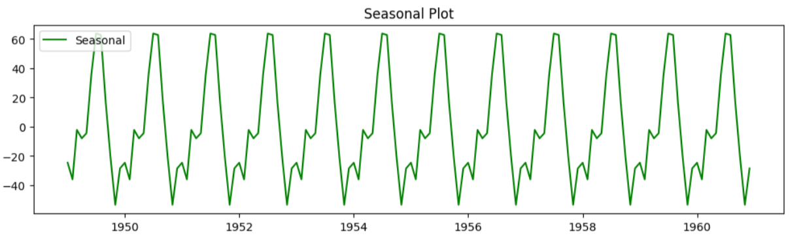
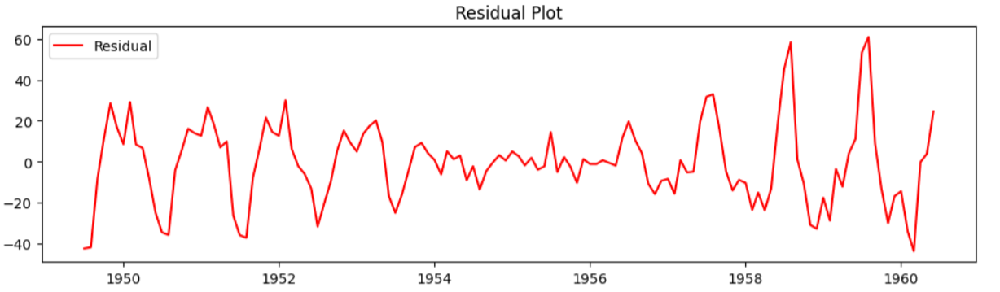

## Devloped by: Sreevalsan V
## Register Number: 212223240158
## Date: 4-03-2025

# Ex.No: 05  IMPLEMENTATION OF TIME SERIES ANALYSIS AND DECOMPOSITION

### AIM:
To Illustrates how to perform time series analysis and decomposition on the monthly average airline passenger count.

### ALGORITHM:
1. Import the required packages like pandas and numpy
2. Read the data using the pandas
3. Perform the decomposition process for the required data.
4. Plot the data according to need, either seasonal_decomposition or trend plot.
5. Display the overall results.

### PROGRAM:

Import necessary modules

```py
import pandas as pd
import numpy as np
import matplotlib.pyplot as plt
from statsmodels.tsa.seasonal import seasonal_decompose
```
```py
# Step 1: Load the dataset,Convert 'Month' column to datetime format,Set it as index
data = pd.read_csv('AirPassengers.csv',parse_dates=['Month'],index_col='Month')

# Step 2: Perform seasonal decomposition using the correct column name
decomposition = seasonal_decompose(data['#Passengers'], model='additive',period=12)

# Step 3: Plot the decomposition
plt.figure(figsize=(10, 12))  # Adjust the figure size for a square shape

# decomposition.plot() this plots all four of teh following graphs

# Original Data
plt.subplot(411)
plt.plot(data['#Passengers'], label='Monthly Passengers')
plt.legend(loc='upper left')
plt.title('Monthly Passengers')

# Trend Plot
plt.subplot(412)
plt.plot(decomposition.trend, label='Trend', color='orange')
plt.legend(loc='upper left')
plt.title('Linear Trend Plot')

# Seasonal Plot
plt.subplot(413)
plt.plot(decomposition.seasonal, label='Seasonal', color='green')
plt.legend(loc='upper left')
plt.title('Seasonality Plot')

# Residual Plot
plt.subplot(414)
plt.plot(decomposition.resid, label='Residual', color='red')
plt.legend(loc='upper left')
plt.title('Residual Plot')

plt.tight_layout()
plt.show()
```

### OUTPUT:

Original Time series data:



Linear Trend plot:



Seasonality plot:



Residual plot:




### RESULT:
Thus we have created the python code for the time series analysis and decomposition.
